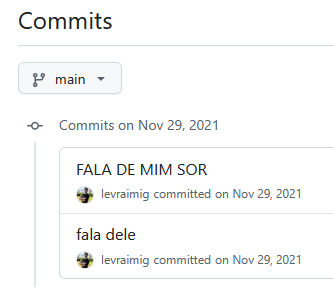
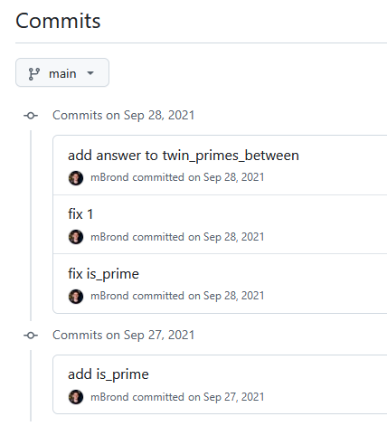
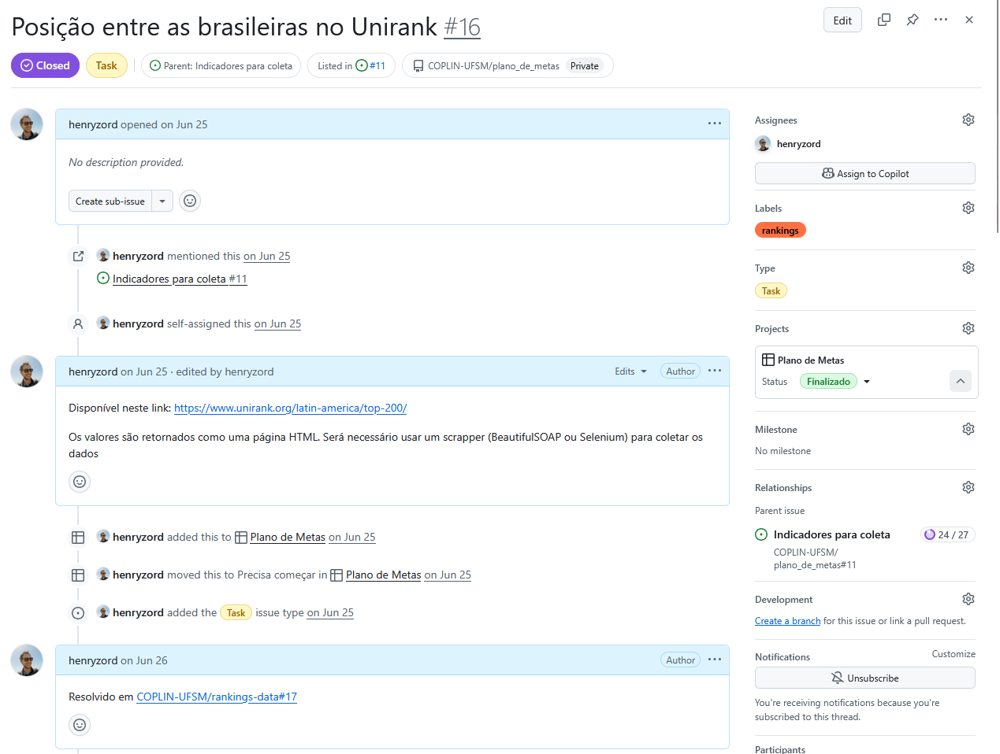
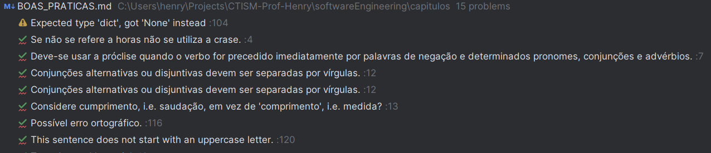
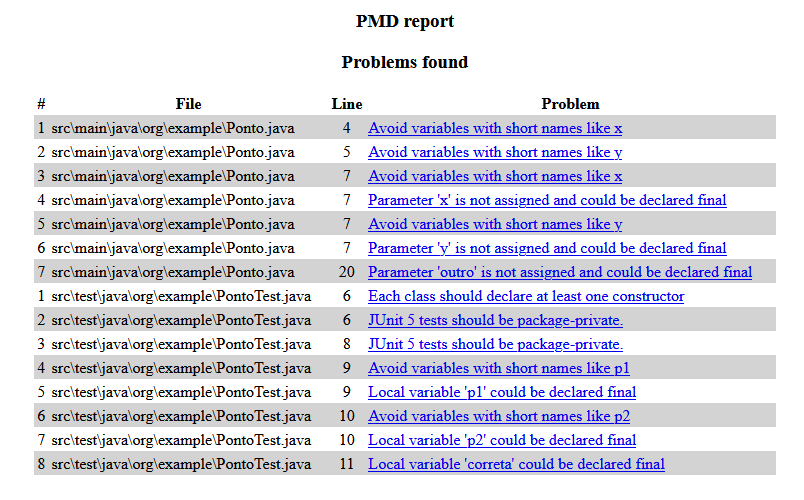
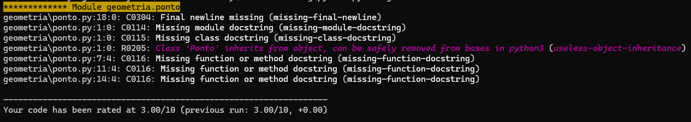
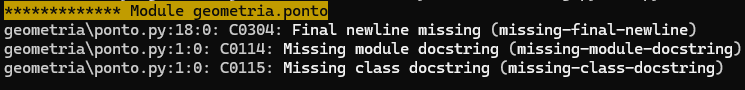

# Boas práticas de Programação

A Engenharia de Software é uma área da Ciência da Computação que trata sobre diversos aspectos do desenvolvimento de 
software, tanto individualmente quanto em equipe. O primeiro passo para integrar-se bem a uma equipe de desenvolvimento
é possuir uma boa base de condutas, tanto no porte com os colegas quanto na prática de programação.

Algumas empresas como [Google](https://google.github.io/styleguide) e [Meta](https://exploringjs.com/es5/ch26.html) 
possuem políticas estritas de como código-fonte deve ser escrito. Esta página visa apresentar algumas dessas práticas, 
e maneiras de segui-las.

## Evite o aninhamento prematuro de código-fonte

Códigos com muitos níveis de decisão são difíceis de ler e manter. Prefira colocar uma instrução `return` ou usar 
encapsulamento com métodos ou funções para reduzir o comprimento horizontal do código-fonte:

❌ Ruim:

```python
def processa_usuario(usuario: dict) -> bool:
   if usuario is not None:
       if usuario['ativo']:
           if usuario['idade'] > 18:
               return True
           else:
              return False
       else:
          return False
   else:
        return False
```

✅ Melhor:

```python
def processa_usuario(usuario: dict) -> bool:
    if (usuario is None) or (not usuario['ativo']):
        return False
    if usuario['idade'] <= 18:
        return False
    return True
```

## Comente o "por que", não o "como"  

Se o código precisar de muito comentário para ser entendido, ele precisa provavelmente de [refatoração](REFATORACAO.md).
Nomes de variáveis e funções devem ser autoexplicativos!

❌ Ruim:

```C
/**
 * Este código copia uma string da origem (src) para o destino (dest).
 * Ele funciona da seguinte forma:
 * - Uma string em C é um bloco contíguo de caracteres `char`, terminando com um byte zero.
 * - O loop continua enquanto a condição for avaliada como diferente de zero (verdadeira).
 * - `*src` lê o caractere na posição de memória atual apontada por src.
 * - `src++` move o ponteiro src para o próximo caractere na string.
 * - A atribuição `(*dest = *src)` copia o caractere atual para o local apontado por dest.
 * - `dest++` avança o ponteiro dest para a próxima posição de memória.
 * - O loop termina quando o caractere copiado é o byte zero, indicando o fim da string.
 */
while(*dest++ = *src++);
```

✅ Melhor:

```C
/**
 * Esse código copia uma string da origem (src) para o destino (dest) 
 */
while(*src != '\0') {
    *dest = *src;
    dest++;
    src++;
}
*dest = *src;
```

## Use nomes claros e consistentes  
   
Variáveis, funções e classes devem descrever exatamente o que fazem ou representam. Nomes vagos como `data`, `temp` ou
`obj` dificultam a leitura por outras pessoas!

## Versione tudo e faça commits pequenos

Cada commit deve representar **uma mudança coesa**. Commits muito grandes dificultam revisão de código e rastreamento
de bugs.

Além disso: a mensagem do commit deve explicar o que você fez naquele commit. Se você precisar voltar no tempo para achar
uma versão anterior de uma função, é melhor que a mensagem do commit seja auto-explicativa!

❌ Ruim:



✅ Melhor:



## Escreva testes automatizados desde o início  

Testes unitários e de componentes ajudam a garantir que novas alterações não quebrem funcionalidades existentes,
facilitando colaboração.

Inclusive, [escreva testes antes](TESTES_DE_SOFTWARE.md#test-driven-development) de escrever o código-fonte da 
funcionalidade!

✅ Melhor:

```python
def processa_usuario(usuario: dict) -> bool:
    if (usuario is None) or (not usuario['ativo']):
        return False
    if usuario['idade'] <= 18:
        return False
    return True

def test_processa_usuario():
    assert processa_usuario(None) is False
    assert processa_usuario({}) is None
    assert processa_usuario({'nome': 'henry', 'ativo': True}) is False
    assert processa_usuario({'nome': 'henry', 'ativo': True, 'idade': 33}) is True
```

> [!NOTE]
> Você reparou que o teste acima pegou dois erros que não haviam sido previstos originalmente na implementação do 
> código-fonte? Você sabe dizer que erros são esses?

## Use padronização

Padronizar espaçamento, nomeação e formatação de código evita discussões desnecessárias e melhora a legibilidade geral 
do código-fonte.

❌ Ruim:

```python
def SomaNumeros(x,y):return x+y

def   media (x,y): return SomaNumeros(x,y)/2

print("Resultado:",media(  5,10  ))
```

✅ Melhor:

```python
def soma_numeros(x: int, y: int) -> int:
    """Retorna a soma de dois números."""
    return x + y


def media(x: int, y: int) -> float:
    """Retorna a média de dois números."""
    return soma_numeros(x, y) / 2


if __name__ == "__main__":
    print("Resultado:", media(5, 10))
```

## Prefira modularidade e reuso  

Quebre funcionalidades em **componentes ou funções reutilizáveis** para facilitar manutenção e testes.

❌ Ruim:

```python
def criar_conta(nome, saldo_inicial):
    return {"nome": nome, "saldo": saldo_inicial}

def depositar(conta, valor):
    conta["saldo"] += valor

def sacar(conta, valor):
    if conta["saldo"] >= valor:
        conta["saldo"] -= valor
    else:
        print("Saldo insuficiente!")

def exibir_conta(conta):
    print(f"Cliente: {conta['nome']} | Saldo: {conta['saldo']}")
    

def main():
    conta = criar_conta("Maria", 100)
    depositar(conta, 50)
    sacar(conta, 200)
    exibir_conta(conta)

    
if __name__ == '__main__':
    main()
```

✅ Melhor:

```python
class ContaBancaria:
    def __init__(self, nome: str, saldo_inicial: float = 0.0):
        self.nome = nome
        self.saldo = saldo_inicial

    def depositar(self, valor: float) -> None:
        self.saldo += valor

    def sacar(self, valor: float) -> None:
        if self.saldo >= valor:
            self.saldo -= valor
        else:
            print("Saldo insuficiente!")

    def exibir(self) -> None:
        print(f"Cliente: {self.nome} | Saldo: {self.saldo:.2f}")


def main():
    conta = ContaBancaria("Maria", 100)
    conta.depositar(50)
    conta.sacar(200)
    conta.exibir()


if __name__ == "__main__":
    main()
```

## Documente decisões técnicas  

Nem tudo vai no código. Arquivos como `README.md`, issues, ou wikis internas ajudam novos membros a entenderem o 
contexto e as escolhas do projeto.



## Tenha cuidado com dependências externas

Escolha bibliotecas bem mantidas, com licenças adequadas, e evite acoplamento excessivo que dificulte futuras 
atualizações.

Às vezes, uma biblioteca experimental resolve perfeitamente o problema - mas é mantida por um aluno de mestrado, ou
apenas uma pessoa, e logo que atualiza uma versão, ela deixa de ser mantida. Cuidado com isso!

Um exemplo de biblioteca que deixou de ser mantida é o conector do 
[banco IBM DB2 para Django](https://github.com/ibmdb/python-ibmdb-django).

## Use linters  

Você sabia que as IDEs da Intellij (Pycharm, Intellij IDEA, Webstorm, etc) possuem linters integrados? Esses programas
detectam erros comuns de programação e sugerem correções. Ao prestar atenção em um linter, você estará escrevendo 
código-fonte mais legível e com menos possibilidade de manutenção.

### Linters no ambiente de desenvolvimento integrado (IDE)

Algumas IDEs possuem linters integrados. As IDEs da Intellij mostram, o número de erros e warnings do código-fonte do 
arquivo:

Ícone no canto superior direito do Pycharm:


Ao clicar no ícone, uma aba mostra os detalhes dos itens:



### Linters na linha de comando

Também é possível rodar linters pela linha de comando, gerando relatórios que podem ser analisados posteriormente, sem
abrir o código-fonte.

#### Em Java

Existem diversos linters para Java. Nesse exemplo, usaremos o PMD. As instruções aqui descritas são para Windows, mas 
o site fornece um tutorial para outras linguagens:

1. Acesse https://pmd.github.io 
2. Baixe o .zip do arquivo
3. Siga as instruções da página para adicionar o binário à variável PATH do sistema
4. Execute com
   ```bash
   pmd check -d src -R category/java/bestpractices.xml,category/java/codestyle.xml,category/java/errorprone.xml,category/java/performance.xml,category/java/security.xml -f html -r relatorio.html
   ```
   Isso vai rodar o linter na pasta `src` usando as regras especificadas pelo parâmetro `-R`, gerando um arquivo do tipo
   `html` em `relatiorio.html`
5. A saída do linter no documento html será parecida com isso:
   


#### Em Python

Python já possui um linter nativo incluso, chamado `pylint`. Esse linter inclusive é recomendado pelo [Codestyle do 
Google](https://google.github.io/styleguide/pyguide.html).

Para executá-lo pela linha de comando:

```bash
pylint <diretório> -f colorized
```

Isso gerará uma saída na linha de comando da seguinte forma:



Para usar o codestyle do Google:

1. Baixe o arquivo da página de [Codestyle do Google](https://google.github.io/styleguide/pyguide.html)
2. Execute pela linha de comando com
   ```bash
   pylint --rcfile=pylintrc <diretório> -f colorized
   ```

3. A saída será algo parecido com a execução do comando anterior:
   