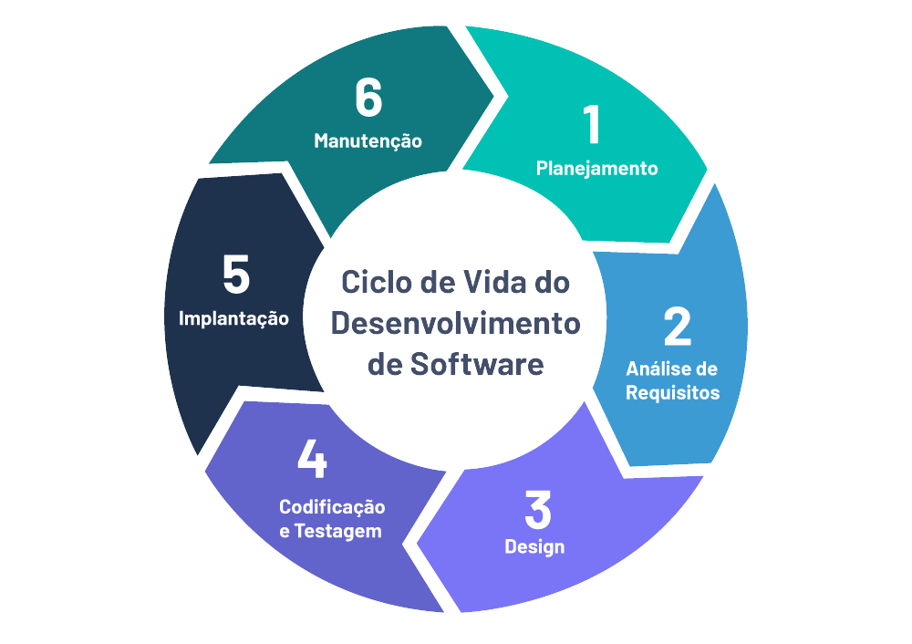
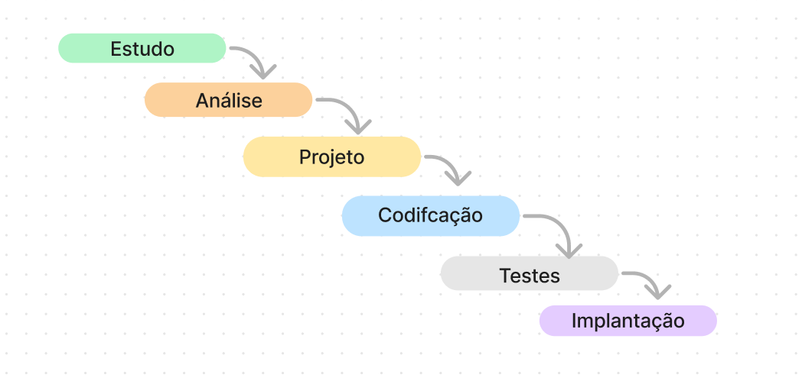
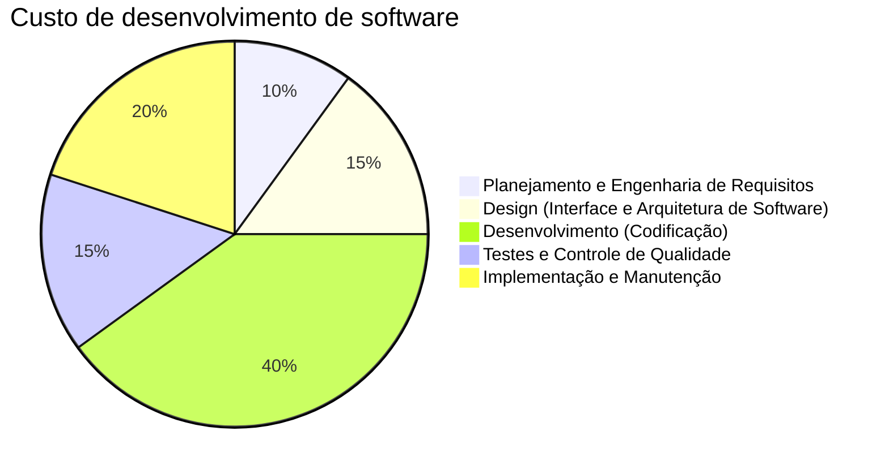

## O que é Software?

Programas de computador e documentação associada. Os produtos de software podem ser desenvolvidos para um cliente
específico ou para um mercado geral.

## O que é Engenharia de Software?

Engenharia de software é uma disciplina de engenharia relacionada a todos os aspectos de produção de software.

## Qual é a diferença entre engenharia de software e Ciência da Computação?

A ciência da computação está relacionada com teorias e fundamentos, enquanto a engenharia de software está relacionada 
com a prática de desenvolvimento e entrega de software útil.

## Qual é a diferença entre engenharia de software e engenharia de sistemas?

A engenharia de sistemas está relacionada a todos os aspectos de desenvolvimento de sistemas baseados em computadores,
incluindo hardware, software e engenharia de processo. A engenharia de software é parte desse processo.

## O que é um processo de software?

Um conjunto de atividades cujo objetivo é o desenvolvimento ou a evolução de software.

## O que é um modelo de processo de software?

Uma representação simplificada de um processo de software, apresentado sob perspectiva específica.
Existem diversos modelos de software, e a escolha do "melhor modelo" depende do tipo de aplicação que será
desenvolvida.

## Quais são os custos da engenharia de software?

De acordo com o site [Boundev](https://www.boundev.com/blog/software-development-costs-2026-guide), os custos de 
desenvolvimento de software, por etapa, são:

## O que são métodos de engenharia de software?

Abordagens estruturadas para desenvolvimento de software que incluem modelos de sistema, notações, regras, recomendações
de projeto e guias de processo.

Exemplos:
* Notações (e.g. Diagramas UML)
* Design patterns
* Orientações de desenvolvimento (e.g. boas práticas de codificação)
* Ferramentas

## O que é CASE (computer-aided software engineering)?

Sistemas de software que têm a intenção de fornecer apoio automatizado para atividades de processo de software. Sistemas
CASE são freqüentemente usados para apoio ao método.

## Quais são os atributos de um bom software?

O software deve fornecer a funcionalidade e o desempenho exigidos pelo usuário e deve ser fácil de manter, ser confiável e
usável.

## Quais são os desafios-chave da engenharia de software?

Estar à altura do aumento de diversidade, demandas para redução do tempo de entrega e desenvolvimento de software digno
de confiança.

## Bibliografia

[^1]: Sommerville, Ian: Engenharia de Software 9ª edição. Pearson Prentice Hall, 2011.
