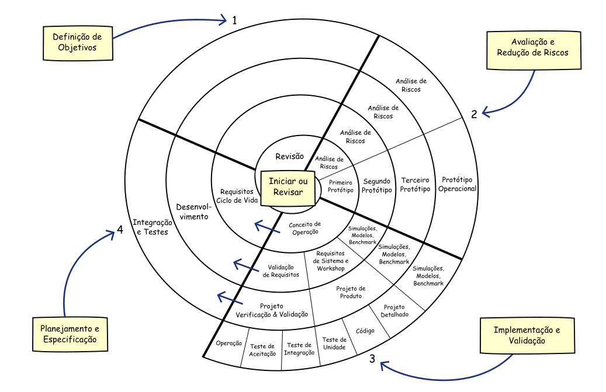

# Processo de Software

Um **processo de software** é um conjunto coerente de atividades para a produção de software[^1]. Existem muitos 
processos de software diferente, mas todos devem incluir quatro atividades fundamentais:

* _Especificação de Software:_ Requisitos funcionais e não-funcionais do software, bem como restrições
* _Projeto e implementação de software:_ Codificação e configuração de hardware, redes e softwares correlatos
* _Validação de software:_ Validação para garantir que atende às necessidades do cliente (e.g. testes)
* _Evolução de software:_ Adaptação à novas demandas do cliente no decorrer do tempo

## Modelos de Processo de Software

Existem **diversos** modelos de processo de software. Os exemplos trazidos nesta seção **não são** a totalidade do que
há disponível na literatura, mas tão somente um subconjunto explicativo.

### Modelo em cascata

O modelo em cascata é um modelo linear, em que apenas se adentra a uma etapa após concluir todas as tarefas da etapa 
anterior. Caso alguma tarefa fique pendente ou incompleta, proveniente de uma etapa anterior, então o projeto não deve
avançar até que todas as pendências sejam resolvidas.

```mermaid
flowchart TD
    style A fill:#BEE3DB,stroke:#333,stroke-width:2px
    style B fill:#BEE3DB,stroke:#333,stroke-width:2px
    style C fill:#BEE3DB,stroke:#333,stroke-width:2px
    style D fill:#BEE3DB,stroke:#333,stroke-width:2px
    style E fill:#BEE3DB,stroke:#333,stroke-width:2px    
    
    A["Definição<br>de Requisitos"]
    B["Projeto de<br>sistema e software"]
    C["Implementação e<br>teste unitário"]
    D["Integração e<br>teste de sistema"]
    E["Operação<br>e manutenção"]

    A --> B
    B --> C
    C --> D
    D --> E
    E --> A
    E --> B
    E --> C
    E --> D
```

Esse modelo de processo de software é adequado quando conhece-se de antemão todos os requisitos do sistema, e é 
improvável que eles sejam modificados no futuro, como software embarcado, construção de sistemas críticos (e.g. a 
corrida espacial dos anos 60), dentre outros sistemas.

### Modelo incremental

"O desenvolvimento incremental é baseado na ideia de desenvolver uma versão inicial, expô-la aos comentários dos 
usuários, e continuar por meio da criação de várias versões até que um sistema adequado seja desenvolvido"[^1].

```mermaid
flowchart TD
    style A fill:#BEE3DB,stroke:#333,stroke-width:2px
    
    style B fill:#FFD6BA,stroke:#333,stroke-width:2px
    style C fill:#FFD6BA,stroke:#333,stroke-width:2px
    style D fill:#FFD6BA,stroke:#333,stroke-width:2px
    
    style E fill:#FAF9F9,stroke:#333,stroke-width:2px
    style F fill:#FAF9F9,stroke:#333,stroke-width:2px
    style G fill:#FAF9F9,stroke:#333,stroke-width:2px


    A[Descrição do esboço]
    
    A --> C

    subgraph "atividades simultâneas"
        direction LR
        B[Especificação]
        C[Desenvolvimento]
        D[Validação]

        B --> C
        C --> B
        C --> D
        D --> C

    end

    subgraph "versões"
        direction LR

        E@{ shape: doc, label: "Versão inicial" }
        G@{ shape: doc, label: "Versão final" }

        B --> E
        E --> B

        F@{ shape: docs, label: "Versões intermediárias" }

        C --> F
        F --> C

        D --> G
        G --> D
    end
```

O modelo incremental é mais adequado a sistemas que mudam de requisitos a cada rodada de desenvolvimento, ou que possuem
especificações para as quais não se conhece a totalidade do cenário a ser implementado (por exemplo, funcionalidades em 
uma rede social). Este é um modelo usado principalmente pelos metodos ágeis.

Em contrapartida, o modelo incremental possui duas desvantagens frente ao modelo em cascata:

* A tendência é que a estrutura interna do software se degrade a medida que novos recursos são adicionados, exigindo que
  refatoração seja utilizada. Do contrário, novas modificações no sistema serão difíceis e onerosas.
* É difícil acompanhar a progressão do projeto. Os gerentes de projeto precisam de entregas regulares para mensurar o 
  progresso do desenvolvimento. Por outro lado, se o software for desenvolvido muito rapidamente, não é economicamente
  viável gerar artefatos (e.g. documentação) para cada versão do software.

#### Modelo em espiral (Boehm)

É um subtipo de modelo incremental, em que a análise de riscos do software é incorporada ao processo de desenvolvimento, 
bem como o desenvolvimento de protótipos para mitigação de certos riscos.

### Modelo orientado a reuso

O modelo de software orientado a reuso reutiliza componentes já desenvolvidos de outros projetos. Por exemplo, podemos
considerar a biblioteca [Bootstrap](https://getbootstrap.com) como um exemplo simples dessa prática. Todavia, componentes
específicos (como interfaces de acesso a banco de dados, entrada e saída, etc) também podem ser reutilizados.

```mermaid
flowchart TD
    style A fill:#BEE3DB,stroke:#333,stroke-width:2px
    style B fill:#BEE3DB,stroke:#333,stroke-width:2px
    style C fill:#BEE3DB,stroke:#333,stroke-width:2px
    style D fill:#BEE3DB,stroke:#333,stroke-width:2px
    style E fill:#BEE3DB,stroke:#333,stroke-width:2px
    style F fill:#BEE3DB,stroke:#333,stroke-width:2px
    
    
    A["Especificação de requisitos"]
    B["Análise de componentes"]
    C["Alterações nos requisitos"]
    D["Projeto de sistema com reuso"]
    E["Desenvolvimento e integração"]
    F["Validação de sistema"]

    A --> B
    B --> C
    C --> D
    D --> E
    E --> F
```

## Atividades do processo

### Especificação

```mermaid
flowchart LR
    style A fill:#BEE3DB,stroke:#333,stroke-width:2px
    style B fill:#BEE3DB,stroke:#333,stroke-width:2px
    style C fill:#BEE3DB,stroke:#333,stroke-width:2px
    style D fill:#BEE3DB,stroke:#333,stroke-width:2px

    style E fill:#FFD6BA,stroke:#333,stroke-width:2px
    style F fill:#FFD6BA,stroke:#333,stroke-width:2px
    style G fill:#FFD6BA,stroke:#333,stroke-width:2px
    style H fill:#FFD6BA,stroke:#333,stroke-width:2px

    style H fill:#FAF9F9,stroke:#333,stroke-width:2px

    A("Estudo de Viabilidade")
    B("Elicitação e<br>Análise de requisitos")
    C("Especificação<br>de requisitos")
    D("Validação<br>de requisitos")
    E["Relatório<br>de viabilidade"]
    F["Modelos<br>de Sistema"]
    G["Requisitos<br>de usuários<br>e de sistema"]
    H["Documentação<br>de requisitos"]

    A --> B
    A --> E

    B --> C
    B --> F

    C --> D
    C --> B
    C --> G

    D --> C
    D --> H

    F --> H
    G --> H
```

### Projeto e implementação

```mermaid
flowchart TD
    style IP fill:#BEE3DB,stroke:#333,stroke-width:2px
    style ER fill:#BEE3DB,stroke:#333,stroke-width:2px
    style DD fill:#BEE3DB,stroke:#333,stroke-width:2px
    
    style PA fill:#FFD6BA,stroke:#333,stroke-width:2px
    style PI fill:#FFD6BA,stroke:#333,stroke-width:2px
    style PC fill:#FFD6BA,stroke:#333,stroke-width:2px
    style PB fill:#FFD6BA,stroke:#333,stroke-width:2px

    style AS fill:#FAF9F9,stroke:#333,stroke-width:2px
    style EB fill:#FAF9F9,stroke:#333,stroke-width:2px
    style EI fill:#FAF9F9,stroke:#333,stroke-width:2px
    style EC fill:#FAF9F9,stroke:#333,stroke-width:2px
    
    subgraph Entradas_de_projeto ["Entradas de projeto"]
        IP[Informação de plataforma]
        ER[Especificação de requisitos]
        DD[Descrição de dados]
    end

    subgraph Atividades_de_projeto ["Atividades de projeto"]
        PA(Projeto de arquitetura)
        PI(Projeto de interface)
        PC(Projeto de componentes)
        PB(Projeto de banco de dados)

        PA --> PI
        PI --> PC
        PA --> PB
        PI --> PB
        PC --> PB
    end

    subgraph Saídas_de_projeto ["Saídas de projeto"]
        AS[Arquitetura de sistema]
        EB[Especificação de banco de dados]
        EI[Especificação de interface]
        EC[Especificação de componentes]
    end

    Entradas_de_projeto --> Atividades_de_projeto
    Atividades_de_projeto --> Saídas_de_projeto
```

### Validação

Etapas de testes:

```mermaid
flowchart LR
    style A fill:#BEE3DB,stroke:#333,stroke-width:2px
    style B fill:#BEE3DB,stroke:#333,stroke-width:2px
    style C fill:#BEE3DB,stroke:#333,stroke-width:2px
    
    A("Testes de componente")
    B("Testes de sistema")
    C("Testes de aceitação")

    A --> B
    A --> C
    B --> C
    C --> A
```

Fases de testes de um processo de software dirigido a planos:

```mermaid
flowchart TD
    style F fill:#FFD6BA,stroke:#333,stroke-width:2px
    style G fill:#FFD6BA,stroke:#333,stroke-width:2px
    style H fill:#FFD6BA,stroke:#333,stroke-width:2px

    style A fill:#BEE3DB,stroke:#333,stroke-width:2px
    style B fill:#BEE3DB,stroke:#333,stroke-width:2px
    style C fill:#BEE3DB,stroke:#333,stroke-width:2px
    style D fill:#BEE3DB,stroke:#333,stroke-width:2px
    style E fill:#BEE3DB,stroke:#333,stroke-width:2px

    style I fill:#555B6E,stroke:#333,color:#fff,stroke-width:2px
    style J fill:#555B6E,stroke:#333,color:#fff,stroke-width:2px
    style K fill:#555B6E,stroke:#333,color:#fff,stroke-width:2px
    
    style L fill:#FAF9F9,stroke:#333,stroke-width:2px

    A(Especificação de requisitos)
    B(Especificação de sistema)
    C(Projeto de sistema)
    D(Projeto detalhado)
    E(Código e teste unitário e de módulo)
    

    F[Plano de testes de aceitação]
    G[Plano de testes de integração de sistema]
    H[Plano de teste de integração do subsistema]
    
    I(Teste de aceitação)
    J(Teste de integração de sistema)
    K(Teste de integração de subsistema)
    L(Operação)

    K --> J

    J --> I

    I --> L

    A --> B
    A --> F

    B --> C
    B --> F
    B --> G

    C --> D
    C --> G
    C --> H

    D --> E
    D --> H

    E --> K

    F --> I

    G --> J

    H --> K
```

### Evolução

```mermaid
flowchart LR
    style A fill:#BEE3DB,stroke:#333,stroke-width:2px
    style B fill:#BEE3DB,stroke:#333,stroke-width:2px
    style C fill:#BEE3DB,stroke:#333,stroke-width:2px
    style D fill:#BEE3DB,stroke:#333,stroke-width:2px

    style E fill:#FFD6BA,stroke:#333,stroke-width:2px
    style F fill:#FFD6BA,stroke:#333,stroke-width:2px

    A("Definir<br>requisitos<br>do sistema")
    B("Avaliar<br>sistemas<br>existentes")
    C("Propor<br>mudanças<br>de sistema")
    D("Modificar sistemas")
    E["Sistemas existentes"]
    F["Novo sistema"]

    A --> B

    B --> C
    C --> D
    E --> B
    D --> A
    
    D --> F

    F --> B
    
```

## Lidando com mudanças

Segundo Sommerville[^1], é inevitável que ocorra mudança nos requisitos de um software durante seu desenvolvimento. 
É preciso portanto lidar com as mudanças de maneira que minimize-se a quantidade de retrabalho necessário.

Existem duas maneiras de lidar com mudanças: evitá-las ou acomodá-las.

1. Na modalidade de evitar mudanças, pode-se projetar protótipos de um software, de maneira que o usuário possa 
   experimentá-lo e fornecer feedback antes que o mesmo seja concluído;
2. Na modalidade de acomodá-las, adota-se um projeto de desenvolvimento incremental, em que recursos do software são 
   entregues gradualmente, prevenindo que muitos recursos sejam dispendidos para análise de requisitos que no futuro 
   poderão ser descartados.

## Bibliografia

[^1]: Sommerville, I. Engenharia de Software. 9ª Edição. (2011).